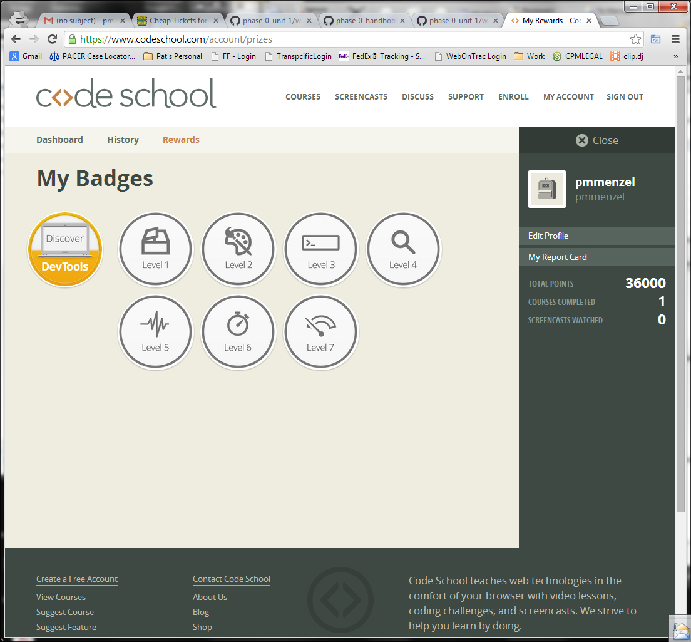
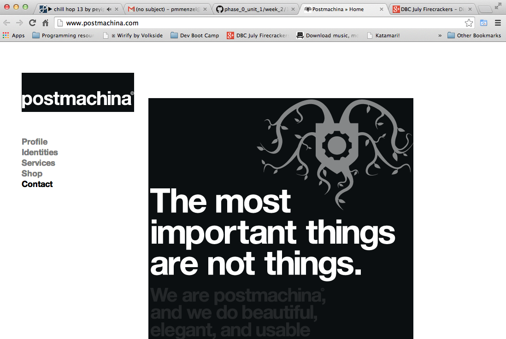

#### Include an inline screenshot of your codeschool's points from the profile page:

<!-- Modify the Markdown to include your answers. Don't delete the questions! -->

##QUIZ
* Explain which tabs support the following actions and how.
  * Realtime editing of HTML and CSS

Under the "Elements" tab is where you can do Realtime editing of HTML and CSS.  This section is broken into two halves:  Left - HMTL editing window; Right - CSS editing window. 

  * Javascript Debugging

For Javascript Debugging, you will go to the "Sources" Tab.  Here you will be to see errors that might occur.  You should utilize the "Pause on exceptions" button to identify exactly where errors are occurring.  You can also test various elements in the console to see if that is in fact the root of the error. 

  * Performance Optimization 

You'll want to use the "Network" tab for performance optimization.  Here you'll be able to see what's loading, how long its taking to load and the various file sizes for different documents like your HTML, CSS and JS docs.

* What's the quick key for your OS to spawn the Dev Tools inspector?

command + option + J

* Go to http://www.postmachina.com/ and analyze and tweak this nicely designed page.
  * What is the current background color for the page?  (Surprisingly, it's not just black!)

The color identified is mostly blue but on the dark side of the spectrum of blue.  So its a dark black blue. 

  * Tweak the background color to white. 
  * Tweak the height of the side bar that contains the logo.  Shrink it down to 85px.
  * Roll over the navigation links.  When you hover over them, they dissapear.  Let's change the hover color to black instead.
  * Now take a screenshot of your new (and maybe not so improved) design.  It should match this screenshot: http://postimg.org/image/5ak1jkpl5/
  * Upload your own image to the imgs directory in the `1_Chrome_Dev_Tools` directory.  It should match the image above. The last nav link in the image above is black because the mouse was hovering there when the screenshot was taken. Do the same, and don't take a screenshot of your whole desktop, just the browser window. (This is part of the challenge.)

 

* For the postmachina website, why can't you tweak the color of the text "The most important things are not things"?  Please explain.

When you inspect that that part of the page it brings you to the "Elements" tab and if you look at your CSS section you'll see that the "background" is set to "url ('..images/home_bg.gif')" which tells you that its actually an image not an html manual input. 

* Go to www.ticketswizard.com and analyze the page.  
  * What is the largest image on the website? 

The largest image is: 
92624182-c482-4a35-8da2-4fbf2f502e94_Large_Large.png 

This is one of the images that show up under "Featured Events"

  * Explain how you would find out this information, and list the URL of offending image here and how big it is.

I was able to determine this by going to the "Network" tab and sorting the waterfall list by size.  Then I simply look for the image with the largest size.   The largest image I found was 316KBs and this is the url: http://www.ticketswizard.com/Images/Catalog/92624182-c482-4a35-8da2-4fbf2f502e94_Large_Large.png

* Test the www.ticketswizard.com website with google's [PageSpeed Insights](http://www.ticketswizard.com/).  (You can also download the chrome plugin).  What is the easiest thing to change to optimize the website?  How many kilobytes of data can be eliminated?

I believe the easiest thing to change to the optimize the website would be to optimize the images on the page by reformatting and compressing them.   This could eliminate 885.9KiBs.

